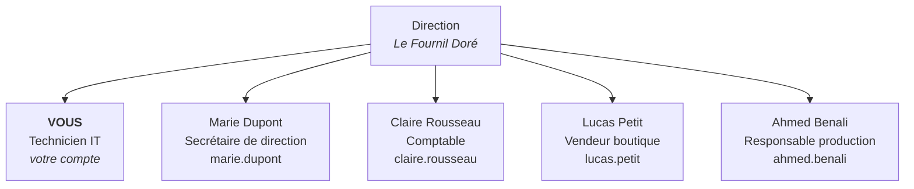

# 00 — Contexte : Le Fournil Doré

> [!NOTE] À lire avant de commencer
> Tous les ateliers de cette formation se déroulent dans la même entreprise fictive : **Le Fournil Doré**. Cette fiche vous donne l'organisation de l'entreprise et les repères GLPI dont vous aurez besoin. Gardez-la ouverte pendant les ateliers, on y revient en permanence.

---

## Pourquoi cette fiche

Cette formation ITIL utilise **GLPI** comme outil de mise en pratique. L'environnement a déjà été préparé pour vous : l'entreprise, les utilisateurs, les catégories et le matériel sont créés sur le serveur.

Vous n'avez donc **rien à installer ni à configurer**. Vous arrivez dans un GLPI déjà en place, comme un technicien qui prend son poste dans une entreprise existante. Cette fiche joue le rôle du « dossier de reprise » qu'on vous remettrait le premier jour.

---

## L'entreprise

**Le Fournil Doré** — boulangerie artisanale.

L'entreprise a deux implantations, un laboratoire de production et une boutique. Elle a grandi vite et gère son informatique « à l'oral » : quand quelque chose ne marche pas, on appelle le technicien. Rien n'est tracé, rien n'est mesuré, les mêmes pannes reviennent sans que personne ne s'en rende compte.

**Vous venez d'être recruté comme technicien IT du Fournil Doré.** Votre mission : structurer tout ça avec ITIL et GLPI.

> Dans tous les ateliers, vous êtes vous-même. Vous vous connectez avec **votre propre compte**, et c'est à ce compte que vous attribuez les tickets.

---

## Organigramme



| Login             | Nom             | Rôle dans l'entreprise  | Entité          |
| ----------------- | --------------- | ----------------------- | --------------- |
| _votre compte_    | **Vous**        | Technicien IT           | Le Fournil Doré |
| `lucas.petit`     | Lucas Petit     | Vendeur boutique        | Boutique        |
| `marie.dupont`    | Marie Dupont    | Secrétaire de direction | Boutique        |
| `ahmed.benali`    | Ahmed Benali    | Responsable production  | Laboratoire     |
| `claire.rousseau` | Claire Rousseau | Comptable               | Le Fournil Doré |

> Ces quatre collègues sont vos **utilisateurs**. Vous ne vous connectez jamais avec eux : ils vous servent de **demandeurs** dans les tickets que vous allez créer.

---

## Entités

Une **entité** dans GLPI, c'est une unité de gestion : elle cloisonne les données. Un utilisateur rattaché à une entité ne voit que ce qui s'y trouve.

```
Le Fournil Doré          ← entité racine
├── Boutique             ← le magasin, la vente
└── Laboratoire          ← la production, le fournil
```

---

## Lieux

Un **lieu** est un emplacement physique. À ne pas confondre avec l'entité.

```
Nantes — 32 Bd Vincent Gâche, 44200 Nantes
├── Salle serveur
└── Open space           ← postes et équipements bureau/boutique

Rennes — 3 Pl. du Général-Giraud, 35000 Rennes
├── Salle serveur
└── Open space
```

> [!WARNING] Piège classique
> « Boutique » est une **entité** (qui gère quoi), « Nantes > Open space » est un **lieu** (où c'est physiquement). Un même lieu peut héberger du matériel de plusieurs entités. On confond souvent les deux les premiers jours.

---

## Catégories de tickets disponibles

Ces catégories ITIL sont déjà configurées. Vous les retrouverez dans le champ **Catégorie** de chaque ticket.

```
Matériel
├── Ordinateur
└── Imprimante

Réseau
├── Wi-Fi
└── Internet

Logiciel
├── Installation
└── Dysfonctionnement

Accès & Comptes

Four & Production
```

---

## Le matériel du scénario

Un équipement revient dans presque tous les ateliers — c'est le fil rouge de la formation :

| Nom                    | Type                                                | Entité   | Lieu                | Utilisateur |
| ---------------------- | --------------------------------------------------- | -------- | ------------------- | ----------- |
| `IMP-NAN-OPENSPACE-01` | Imprimante laser multifonction Brother MFC-L8900CDW | Boutique | Nantes > Open space | lucas.petit |

Cette imprimante va tomber en panne trois fois en trois semaines. Vous allez traiter ces pannes comme des **incidents** (ch. 03), découvrir qu'elles cachent un **problème** (ch. 04), corriger la cause racine par un **changement** (ch. 05), puis mesurer le résultat (ch. 06 et 08).

---

## Votre environnement de travail

### Connexion

Le serveur GLPI est **partagé par tout le groupe**. Le formateur vous a remis :

- une **URL** de connexion
- un **identifiant nominatif** (votre nom, pas `thomas.martin`)
- un **mot de passe**

Vous avez un profil **Technicien** : vous pouvez créer et traiter des tickets, gérer le parc, configurer les SLA.

### Règle de nommage — importante

> [!IMPORTANT] Préfixez tout ce que vous créez
> Vous travaillez tous dans la **même entité**, sur le **même serveur**. Sans convention, dix stagiaires créent dix objets portant exactement le même nom et plus personne ne retrouve son travail.
>
> **Chaque fois qu'un atelier vous demande de nommer un objet, préfixez-le par votre prénom entre crochets.**

| L'atelier dit                               | Vous saisissez (si vous vous appelez Marie)         |
| ------------------------------------------- | --------------------------------------------------- |
| `Imprimante hors ligne`                     | `[Marie] Imprimante hors ligne`                     |
| `Pannes récurrentes - IMP-NAN-OPENSPACE-01` | `[Marie] Pannes récurrentes - IMP-NAN-OPENSPACE-01` |
| `SLM Fournil Doré`                          | `[Marie] SLM Fournil Doré`                          |
| `TTO - Prise en charge incidents`           | `[Marie] TTO - Prise en charge incidents`           |

Ça vaut pour **les tickets, les problèmes, les changements, les SLM, les SLA, les niveaux d'escalade et le matériel** que vous créez.

Pour retrouver votre travail à tout moment : dans n'importe quelle liste GLPI, tapez votre prénom dans la recherche. Vous ne verrez que vos objets.

### Repères d'interface

Vous n'avez jamais utilisé GLPI ? Voici les seuls menus dont vous aurez besoin :

| Menu              | Ce qu'on y fait                                                      | Chapitres          |
| ----------------- | -------------------------------------------------------------------- | ------------------ |
| **Assistance**    | Tickets, Problèmes, Changements, Statistiques, Catalogue de services | 03, 04, 05, 07, 08 |
| **Parc**          | Ordinateurs, Imprimantes, Matériels réseau                           | 04, 07             |
| **Configuration** | Niveaux de services (SLA)                                            | 06                 |

Le bouton **`+`** (ou **`+ Ajouter`**) en haut d'une liste sert systématiquement à créer un nouvel élément. C'est à peu près tout ce qu'il faut savoir pour démarrer.

---

## Récapitulatif — à retenir avant de commencer

| Élément                | Valeur                                                   |
| ---------------------- | -------------------------------------------------------- |
| Entreprise             | Le Fournil Doré, boulangerie artisanale                  |
| Votre rôle             | Technicien IT du Fournil Doré — c'est vous               |
| Votre connexion        | Compte nominatif fourni par le formateur                 |
| Demandeurs des tickets | lucas.petit, marie.dupont, claire.rousseau, ahmed.benali |
| Entités                | Le Fournil Doré > Boutique / Laboratoire                 |
| Lieu principal         | Nantes > Open space                                      |
| Équipement fil rouge   | `IMP-NAN-OPENSPACE-01`                                   |
| Règle absolue          | Préfixer vos créations par `[VotrePrénom]`               |

---

Chapitre suivant → [[01-introduction-itil]]
